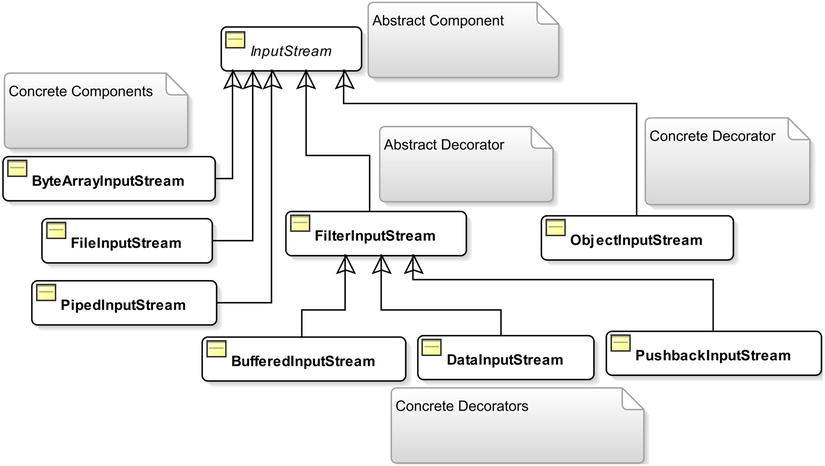
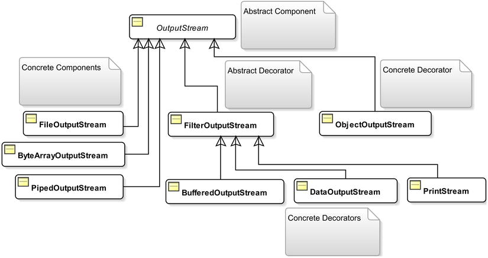

#Java - IO
### Into 
- The java.io and java.nio packages contain Java classes that deal with I/O
- A pathname can be either absolute or relative. An absolute pathname points to the same location in a file system irrespective of the current working directory.
- The concept of the current working directory is related to operating systems, not the Java programming language or Java I/O. When a process 
starts, it uses the current working directory to resolve the relative paths of files. When you run a Java program, the JVM runs as a process, and 
therefore it has a current working directory. The value for the current working directory for a JVM is set depending on how you run the java command.
- You can get the current working directory for the JVM by reading the user.dir system property as follows:
   ```java
    String workingDir = System.getProperty("user.dir");
   ```
- You can also specify the current working directory for the JVM as the user.dir property value as a JVM option
   ```java
   java –Duser.dir=C:\test your-java-class
   ```
  
### The File class 
- A File has a relative,absolute and canonical path 
  - Relative : Relative to the current working directory : notes.txt
  - Absolute : full path , there can be multiple absolute paths for a file , c:/users/notes.txt , /users/../users/notes.txt 
  - canonical : simplest (shortest) Absolute path : /users/notes.txt 
- The File class defines a constant named separatorChar, which is the system-dependent name separator character. 
- You have to deal with two “devils” when you work with I/O in Java. If you do not specify the absolute pathname, your absolute path will be decided by the Java runtime and the operating system. If you specify the absolute pathname, your code may not run on different operating systems. One way to handle this situation is to use a configuration file, where you can specify a different file pathname for different operating systems, and you pass the configuration file path to your program at startup.
- Methods to know
```
exists,isFile,isDirectory ,  : check 
getAbsolutePath,getCanonicalPath,getPath : get different paths 
createNewFile,createTempFile : create files 
mkdir,mkdirs : create directoires 
delete,deleteOnExit : delete 
renameTo :rename 
length : size of the file 
listRoots : list all root directories in the system 
list,listFiles : list all files and directoires in a directory 
```
 ### Input/Output Streams 
- To read data from a data source into a Java program, you need to perform the following steps:
  - Identify the data source. It may be a file, a string, an array, a network connection, etc.
  - Construct an input stream using the data source that you have identified.
  - Read the data from the input stream. Typically, you read the data in a loop until you have read all the data from the input stream. The methods of an input stream return a special value to indicate the end of the input stream.
  - Close the input stream. Note that constructing an input stream itself opens it for reading. 
- To write data to a data sink from a Java program, you need to perform the following steps:
  - Identify the data sink. That is, identify the destination where data will be written. It may be a file, a string, an array, a network connection, etc.
  - Construct an output stream using the data sink that you have identified.
  - Write the data to the output stream.
- Close the output stream. Note that constructing an output stream itself opens it for writing. 

- Input/Output Streams are based on the decorator _pattern_
  

- Important methods in the InputStream class 
 ```
 read,read(byte[] buffer),read(byte[] buffer,int offset,int length) ,close(),available()
 ```

- The InputStream Decorators :
  - **BufferedInputStream** : buffers the data , faster . 
  - **PushBackInputStream** : lets you unread bytes (or push back the read bytes) using its unread() method
   <br/><br/>
- Output streams are similar to input streams 
  
- There are three important methods defined in the abstract superclass OutputStream:
```
 write() : to write bytes to an output stream.
   It has three versions that let you write one byte or multiple bytes at a time. 
- The flush() method is used to flush any buffered bytes to the data sink. The close() method closes the output stream.
```

#### PrintStream 
#### Using Pipes 
#### Reading and Writing Primitive Data Types
#### Object Serialization

